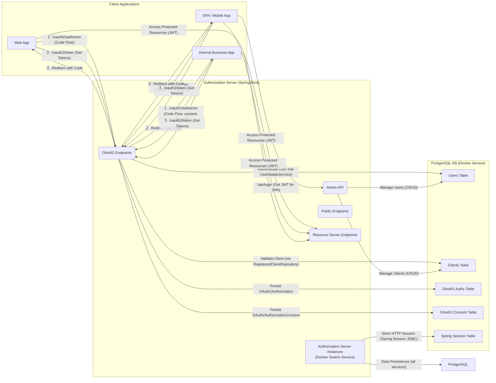

## 認証サーバー 基本設計書

### 1. はじめに

本ドキュメントは、Spring Authorization Server を使用して構築される認証サーバーの基本設計を記述するものです。この認証サーバーは、社内業務アプリケーション群に対するユーザー認証および認可管理を一元的に提供することを目的とします。

### 2. システム概要

*   **システム名**: 社内共通認証認可サーバー (Internal AuthZ Server)
*   **目的**: 社内業務アプリケーションにおけるユーザー認証、アクセストークン発行、およびリソースアクセス認可を一元管理し、セキュリティと開発効率を向上させる。
*   **主要機能**:
    *   ユーザー認証 (Username/Password)
    *   OAuth 2.1 認可コードフロー (PKCE対応)
    *   OpenID Connect 1.0 (IDトークン発行)
    *   アクセストークン/リフレッシュトークン発行
    *   トークン失効 (Revocation)
    *   JWK Set エンドポイント公開
    *   リソースサーバー機能 (JWT検証)
    *   Admin API (ユーザー管理, クライアント管理)

### 3. 環境構成

*   **開発言語**: Java 17+
*   **フレームワーク**: Spring Boot 3.2.x
*   **認可サーバーライブラリ**: Spring Authorization Server 1.2.x
*   **データベース**: PostgreSQL 14+
*   **コンテナオーケストレーション**: Docker Swarm
*   **セッション管理**: Spring Session JDBC (PostgreSQL)

### 4. 論理構成

### 5. コンポーネント設計

#### 5.1. Spring Bootアプリケーション (AuthZ Server)

*   **責任**:
    *   OAuth 2.1 / OpenID Connect プロトコル処理
    *   ユーザー認証
    *   アクセストークン、リフレッシュトークン、IDトークンの発行
    *   JWK Set エンドポイント (公開鍵提供)
    *   リソースサーバー機能 (保護されたAdmin APIの提供)
*   **主要なBean**:
    *   `SecurityFilterChain` (複数)
        *   認可サーバーエンドポイント用 (`/oauth2/**`, `/login`)
        *   API認証エンドポイント用 (`/api/login`)
        *   Admin API用 (`/api/users/**`, `/api/clients/**`)
        *   リソースサーバーエンドポイント用 (`/messages`, `/public/**` など)
    *   `UserDetailsService`: `JdbcUserDetailsManager` を利用し、PostgreSQLからユーザー情報を取得。
    *   `PasswordEncoder`: `BCryptPasswordEncoder` を利用。
    *   `AuthenticationManager`: ユーザー名/パスワード認証に使用。
    *   `RegisteredClientRepository`: `JdbcRegisteredClientRepository` を利用し、PostgreSQLからクライアント情報を取得。
    *   `OAuth2AuthorizationService`: `JdbcOAuth2AuthorizationService` を利用し、PostgreSQLに認可関連データを永続化。
    *   `OAuth2AuthorizationConsentService`: `JdbcOAuth2AuthorizationConsentService` を利用し、PostgreSQLにユーザー同意情報を永続化。
    *   `JWKSource`: RSA鍵ペアをメモリ上で生成（本番ではKMS/HSM連携を検討）。公開鍵を `/oauth2/jwks` で公開。
    *   `JwtEncoder`: `NimbusJwsEncoder` を利用し、JWTを生成。
    *   `AuthorizationServerSettings`: 発行者URI (`issuer`) などを設定。
    *   `HttpSessionIdResolver`: `CookieHttpSessionIdResolver` (デフォルト) を使用し、セッションIDをCookieで管理。
    *   `AuthenticationController`: SPAからの直接認証API (`/api/login`) を提供。
    *   `UserController`: ユーザー管理Admin API (`/api/users`) を提供。
    *   `ClientController`: クライアント管理Admin API (`/api/clients`) を提供。

#### 5.2. PostgreSQL

*   **責任**: 認証サーバーの永続化レイヤー。以下の情報を格納する。
    *   `t_users` テーブル: ユーザー情報
    *   `t_authorities` テーブル: ユーザーの権限（ロール）。
    *   `t_oauth2_registered_client` テーブル: 登録済みクライアント情報。
    *   `t_oauth2_authorization` テーブル: 認可コード、アクセストークン、リフレッシュトークンなどの認可状態。
    *   `t_oauth2_authorization_consent` テーブル: ユーザーの認可同意情報。
    *   `t_spring_session` テーブル: HTTPセッション情報（Spring Session JDBC）。
    *   `t_spring_session_attributes` テーブル: HTTPセッション属性（Spring Session JDBC）。
*   **レプリケーション**: 読み取り性能向上と高可用性のため、リードレプリカの導入を検討。
*   **バックアップ**: 定期的なバックアップ戦略を確立。

#### 5.3. Docker Swarm

*   **責任**: 認証サーバーのコンテナ化とデプロイ、スケーリング、ロードバランシング。
*   **サービス**:
    *   `authz-server`: Spring BootアプリケーションのDockerサービス。複数レプリカで構成。
    *   `postgresql`: PostgreSQLデータベースのDockerサービス。
*   **ロードバランシング**: Docker Swarmの組み込みロードバランサーを使用。
*   **永続ボリューム**: PostgreSQLのデータは永続ボリューム (`volume`) に保存し、コンテナの再起動や削除後もデータが失われないようにする。

### 6. データモデル設計 (DBスキーマ)

提供されたH2のスキーマをベースに、PostgreSQL向けに調整します。日本語の論理名を付加します。

*   **t_users** (テーブル名: `t_users`) - **ユーザー情報**
    *   `username` (VARCHAR(50) PRIMARY KEY) - **ユーザー名**
    *   `password` (VARCHAR(500) NOT NULL) - **パスワード (BCryptハッシュ)**
    *   `enabled` (BOOLEAN NOT NULL) - **有効フラグ**
*   **t_authorities** (テーブル名: `t_authorities`) - **ユーザー権限**
    *   `username` (VARCHAR(50) NOT NULL, FOREIGN KEY REFERENCES t_users(username)) - **ユーザー名**
    *   `authority` (VARCHAR(50) NOT NULL) - **権限名 (ロール)**
    *   複合ユニークキー (`username`, `authority`)
*   **t_oauth2_registered_client** (テーブル名: `t_oauth2_registered_client`) - **登録済みクライアント情報**
    *   `id` (VARCHAR(100) PRIMARY KEY) - **クライアント内部ID**
    *   `client_id` (VARCHAR(100) UNIQUE NOT NULL) - **クライアントID**
    *   `client_id_issued_at` (TIMESTAMP DEFAULT CURRENT_TIMESTAMP NOT NULL) - **クライアントID発行日時**
    *   `client_secret` (VARCHAR(200) NULL) - **クライアントシークレット (BCryptハッシュ)**
    *   `client_secret_expires_at` (TIMESTAMP NULL) - **クライアントシークレット有効期限**
    *   `client_name` (VARCHAR(200) NOT NULL) - **クライアント名**
    *   `client_authentication_methods` (VARCHAR(1000) NOT NULL) - **クライアント認証方式**
    *   `authorization_grant_types` (VARCHAR(1000) NOT NULL) - **認可グラントタイプ**
    *   `redirect_uris` (VARCHAR(1000) NULL) - **リダイレクトURI群**
    *   `scopes` (VARCHAR(1000) NOT NULL) - **許可スコープ群**
    *   `client_settings` (VARCHAR(2000) NOT NULL) - **クライアント設定 (JSON形式)**
    *   `token_settings` (VARCHAR(2000) NOT NULL) - **トークン設定 (JSON形式)**
*   **t_oauth2_authorization** (テーブル名: `t_oauth2_authorization`) - **認可状態情報**
    *   `id` (VARCHAR(100) PRIMARY KEY) - **認可状態ID**
    *   `registered_client_id` (VARCHAR(100) NOT NULL) - **登録済みクライアントID**
    *   `principal_name` (VARCHAR(200) NOT NULL) - **プリンシパル名 (ユーザー名)**
    *   `authorization_grant_type` (VARCHAR(100) NOT NULL) - **認可グラントタイプ**
    *   `authorized_scopes` (VARCHAR(1000) NULL) - **認可済みスコープ群**
    *   `attributes` (VARCHAR(4000) NULL) - **属性情報 (JSON形式)**
    *   `state` (VARCHAR(500) NULL) - **状態 (CSRFトークンなど)**
    *   `authorization_code_value` (VARCHAR(4000) NULL) - **認可コード値**
    *   `authorization_code_issued_at` (TIMESTAMP NULL) - **認可コード発行日時**
    *   `authorization_code_expires_at` (TIMESTAMP NULL) - **認可コード有効期限**
    *   `authorization_code_metadata` (VARCHAR(2000) NULL) - **認可コードメタデータ (JSON形式)**
    *   `access_token_value` (VARCHAR(4000) NULL) - **アクセストークン値**
    *   `access_token_issued_at` (TIMESTAMP NULL) - **アクセストークン発行日時**
    *   `access_token_expires_at` (TIMESTAMP NULL) - **アクセストークン有効期限**
    *   `access_token_metadata` (VARCHAR(2000) NULL) - **アクセストークンメタデータ (JSON形式)**
    *   `access_token_type` (VARCHAR(100) NULL) - **アクセストークンタイプ (例: Bearer)**
    *   `access_token_scopes` (VARCHAR(1000) NULL) - **アクセストークンのスコープ群**
    *   `oidc_id_token_value` (VARCHAR(4000) NULL) - **OIDC IDトークン値**
    *   `oidc_id_token_issued_at` (TIMESTAMP NULL) - **OIDC IDトークン発行日時**
    *   `oidc_id_token_expires_at` (TIMESTAMP NULL) - **OIDC IDトークン有効期限**
    *   `oidc_id_token_metadata` (VARCHAR(2000) NULL) - **OIDC IDトークンメタデータ (JSON形式)**
    *   `oidc_id_token_claims` (VARCHAR(2000) NULL) - **OIDC IDトークンクレーム (JSON形式)**
    *   `refresh_token_value` (VARCHAR(4000) NULL) - **リフレッシュトークン値**
    *   `refresh_token_issued_at` (TIMESTAMP NULL) - **リフレッシュトークン発行日時**
    *   `refresh_token_expires_at` (TIMESTAMP NULL) - **リフレッシュトークン有効期限**
    *   `refresh_token_metadata` (VARCHAR(2000) NULL) - **リフレッシュトークンメタデータ (JSON形式)**
    *   `user_code_value` (VARCHAR(4000) DEFAULT NULL) - **ユーザーコード値 (デバイスコードフロー用)**
    *   `user_code_issued_at` (TIMESTAMP DEFAULT NULL) - **ユーザーコード発行日時**
    *   `user_code_expires_at` (TIMESTAMP DEFAULT NULL) - **ユーザーコード有効期限**
    *   `user_code_metadata` (VARCHAR(2000) DEFAULT NULL) - **ユーザーコードメタデータ**
    *   `device_code_value` (VARCHAR(4000) DEFAULT NULL) - **デバイスコード値 (デバイスコードフロー用)**
    *   `device_code_issued_at` (TIMESTAMP DEFAULT NULL) - **デバイスコード発行日時**
    *   `device_code_expires_at` (TIMESTAMP DEFAULT NULL) - **デバイスコード有効期限**
    *   `device_code_metadata` (VARCHAR(2000) DEFAULT NULL) - **デバイスコードメタデータ**
*   **t_oauth2_authorization_consent** (テーブル名: `t_oauth2_authorization_consent`) - **認可同意情報**
    *   `registered_client_id` (VARCHAR(100) NOT NULL) - **登録済みクライアントID**
    *   `principal_name` (VARCHAR(200) NOT NULL) - **プリンシパル名 (ユーザー名)**
    *   `authorities` (VARCHAR(1000) NOT NULL) - **認可済み権限群 (スコープ)**
    *   PRIMARY KEY (`registered_client_id`, `principal_name`)
*   **t_spring_session** (テーブル名: `t_spring_session`) - **HTTPセッション情報**
    *   `PRIMARY_ID` (CHAR(36) NOT NULL PRIMARY KEY) - **プライマリーID**
    *   `SESSION_ID` (CHAR(36) NOT NULL UNIQUE) - **セッションID**
    *   `CREATION_TIME` (BIGINT NOT NULL) - **作成日時**
    *   `LAST_ACCESS_TIME` (BIGINT NOT NULL) - **最終アクセス日時**
    *   `MAX_INACTIVE_INTERVAL_SECONDS` (INT NOT NULL) - **最大非アクティブ期間 (秒)**
    *   `EXPIRY_TIME` (BIGINT NOT NULL) - **有効期限**
    *   `PRINCIPAL_NAME` (VARCHAR(100) NULL) - **プリンシパル名**
*   **t_spring_session_attributes** (テーブル名: `t_spring_session_attributes`) - **HTTPセッション属性**
    *   `SESSION_PRIMARY_ID` (CHAR(36) NOT NULL, FOREIGN KEY REFERENCES t_spring_session(PRIMARY_ID)) - **セッションプライマリーID**
    *   `ATTRIBUTE_NAME` (VARCHAR(200) NOT NULL) - **属性名**
    *   `ATTRIBUTE_BYTES` (BYTEA NOT NULL) - **属性値 (バイト配列)**
    *   PRIMARY KEY (`SESSION_PRIMARY_ID`, `ATTRIBUTE_NAME`)

### 7. API設計

#### 7.1. 認証サーバー標準エンドポイント

Spring Authorization Serverが提供する標準エンドポイント。

| エンドポイント               | HTTPメソッド | 説明                                                | 認証要件     |
| :--------------------------- | :----------- | :-------------------------------------------------- | :----------- |
| `/oauth2/authorize`          | GET          | 認可コードフローの開始                                  | ログイン済みユーザー |
| `/oauth2/token`              | POST         | アクセストークン/リフレッシュトークンの取得           | クライアント認証 |
| `/oauth2/revoke`             | POST         | トークンの失効                                      | クライアント認証 |
| `/oauth2/introspect`         | POST         | トークンの有効性検証 (リソースサーバー向け)         | クライアント認証 |
| `/oauth2/jwks`               | GET          | 公開鍵セット (JWK Set) の公開                       | なし         |
| `/.well-known/openid-configuration` | GET          | OpenID Connect Discovery エンドポイント             | なし         |

#### 7.2. SPA認証API

| エンドポイント   | HTTPメソッド | 説明                     | リクエストボディ                   | レスポンスボディ              | 認証要件 |
| :--------------- | :----------- | :----------------------- | :--------------------------------- | :-------------------------- | :------- |
| `/api/login`     | POST         | ユーザー名/パスワードでログインし、JWTアクセストークンを取得 | `{"username": "...", "password": "..."}` | `{"accessToken": "..."}`    | なし     |

#### 7.3. Admin API (ユーザー管理)

`ROLE_ADMIN` 権限を持つユーザーのアクセストークンでアクセス可能。

| エンドポイント          | HTTPメソッド | 説明           | リクエストボディ                                | レスポンスボディ                            |
| :---------------------- | :----------- | :------------- | :---------------------------------------------- | :---------------------------------------- |
| `/api/users/{username}` | GET          | ユーザー情報取得 | なし                                            | `UserResponse`                              |
| `/api/users`            | POST         | ユーザー作成     | `UserRequest` (username, password, enabled, roles) | `UserResponse`                              |
| `/api/users/{username}` | PUT          | ユーザー更新     | `UserRequest` (password, enabled, roles)        | `UserResponse`                              |
| `/api/users/{username}` | DELETE       | ユーザー削除     | なし                                            | なし (Status 204 No Content)                |

#### 7.4. Admin API (クライアント管理)

`ROLE_ADMIN` 権限を持つユーザーのアクセストークンでアクセス可能。

| エンドポイント           | HTTPメソッド | 説明             | リクエストボディ                                                | レスポンスボディ                              |
| :----------------------- | :----------- | :--------------- | :-------------------------------------------------------------- | :------------------------------------------ |
| `/api/clients/{clientId}` | GET          | クライアント情報取得 | なし                                                            | `ClientResponse`                              |
| `/api/clients`           | POST         | クライアント作成     | `ClientRequest` (clientId, clientSecret, clientName, ...)       | `ClientResponse`                              |
| `/api/clients/{clientId}` | PUT          | クライアント更新     | `ClientRequest` (clientSecret (任意), clientName, ...)          | `ClientResponse`                              |
| `/api/clients/{clientId}` | DELETE       | クライアント削除     | なし                                                            | なし (Status 204 No Content)                |

#### 7.5. リソースサーバー機能

`ROLE_USER` または `SCOPE_message.read` などの権限を持つユーザーのアクセストークンでアクセス可能。

| エンドポイント   | HTTPメソッド | 説明             | 認証要件                                        |
| :--------------- | :----------- | :--------------- | :---------------------------------------------- |
| `/messages`      | GET          | 保護されたメッセージを取得 | `Bearer Token` (認証済みユーザー)                 |
| `/public/hello`  | GET          | 公開メッセージ取得   | なし                                            |

### 8. セキュリティ設計

*   **HTTPSの必須化**: 全ての通信はHTTPSで行う。
*   **パスワードハッシュ**: `BCryptPasswordEncoder` を使用して、ユーザーおよびクライアントのパスワード/シークレットをハッシュ化して保存。
*   **PKCEの必須化**: 公開クライアント（SPAなど）にはPKCE (Proof Key for Code Exchange) を必須とする。
*   **リダイレクトURIの厳格なホワイトリスト化**: クライアント登録時に許可されたURI以外へのリダイレクトを禁止。
*   **JWKの安全な管理**: 秘密鍵は本番環境ではKMS (Key Management Service) またはHSM (Hardware Security Module) で管理する。起動時にメモリ上で生成する方式は開発環境のみ。
*   **鍵のローテーション**: 定期的なJWK鍵のローテーション戦略を確立し、古い鍵での検証を可能にしつつ新しい鍵で署名を行う。
*   **トークンの失効**: トークン失効エンドポイント (`/oauth2/revoke`) を利用し、必要に応じてアクセストークン/リフレッシュトークンを無効化。
*   **リフレッシュトークンのローテーション**: リフレッシュトークンは一度使用されたら新しいものと交換する（Rolling Refresh Token）戦略を適用。
*   **Admin APIの厳格な認可**: ユーザーおよびクライアント管理APIは、`ROLE_ADMIN` などの特別なロールを持つユーザーのみがアクセスできるように制限。
*   **ロギングと監視**: セキュリティイベント（ログイン成功/失敗、トークン発行、管理APIアクセスなど）を専用のログファイル(security.log)に詳細に記録し、集中ログ管理システムで監視、異常検知時にアラートを発報。
*   **CORSポリシー**: 許可されたOriginのみからのアクセスを許可するようにCORSを設定。

### 9. 運用・保守設計

*   **監視**:
    *   アプリケーションメトリクス (JVM、HTTPリクエスト、DB接続プールなど) をMicrometerで収集し、Prometheus/Grafanaで可視化。
    *   システムリソース (CPU, メモリ, ディスクI/O, ネットワーク) を監視。
    *   ログ監視: エラーログ、セキュリティログを集中ログシステム (Elastic Stackなど) に集約し、リアルタイムで監視・分析。
*   **バックアップ・リカバリ**:
    *   PostgreSQLデータベースの定期的なフルバックアップと差分バックアップ。
    *   必要に応じて秘密鍵素材のバックアップ（KMS/HSM利用の場合はそれらのバックアップ機能に依存）。
    *   災害時におけるDBおよび認証サーバーのリストア手順を明確化。
*   **パッチ管理**:
    *   OS、Java、Spring Boot、Spring Authorization Serverを含む全てのライブラリ/コンポーネントに対して、セキュリティパッチを迅速に適用するプロセスを確立。
*   **スケーリング**:
    *   Docker Swarmのサービスレプリカ数を増減させることで、認証サーバーの水平スケーリングを可能にする。
    *   PostgreSQLのリードレプリカを導入し、読み取り負荷に対応。
*   **デプロイ**:
    *   CI/CDパイプラインを構築し、テスト済みの認証サーバーコンテナイメージをDocker Swarmに自動デプロイする。
